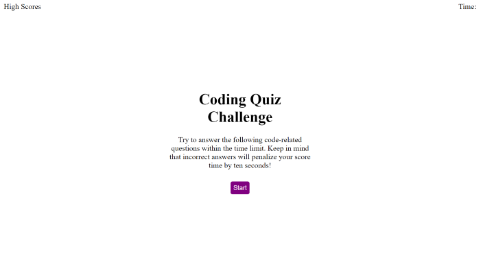
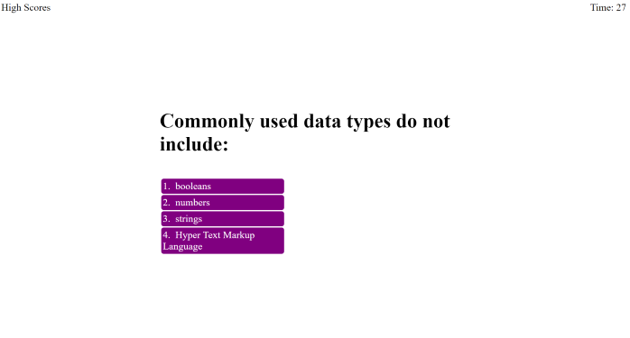
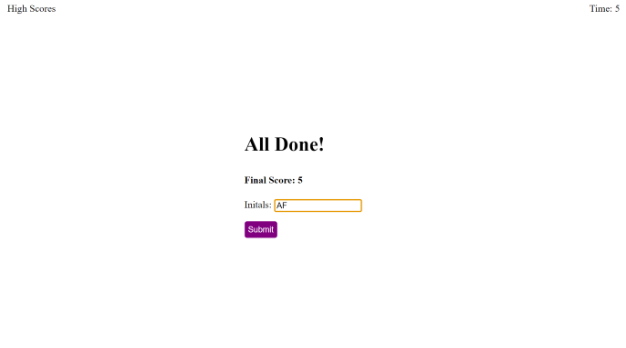

# Code Quiz

## Description

I designed an application to test user's coding knowledge using basic Javascript functions. The custom script allows users to save their score to local storage, and retake the quiz to attain a higher score. I learned how to use a combination of Javascript and CSS to edit, display, or remove HTML elements, as well as how to store and retrieve information from local storage.

## Usage

1. Access the application at the provided URL: https://agarfar.github.io/code-quiz/

2. Click Start to begin the quiz:

3. Answer each question to advance; incorrect answers subtract 10 seconds from the timer.

4. If the timer reaches zero or the user answers all questions, the quiz ends:

5. Enter your initials and press 'Submit' to enter your score. You will be taken to the High Scores page (this can be reached at any time with the 'High Scores' link at the top left of the page):

6. Click 'Clear High Scores' to clear all logged user scores. Click 'Go Back' to navigate to the start page.

## Credits

N/A

## License

N/A